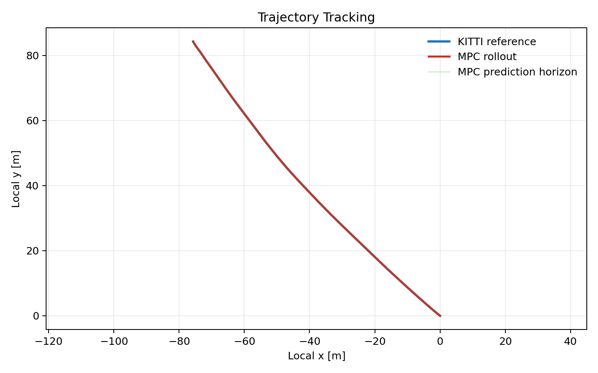
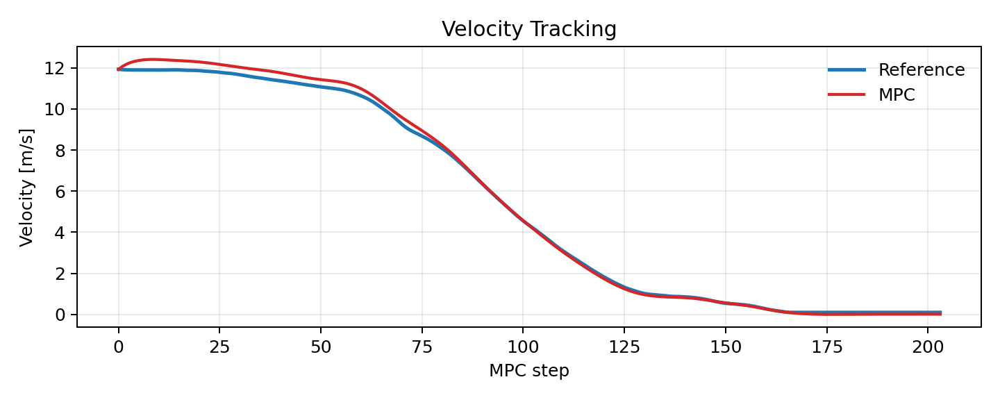
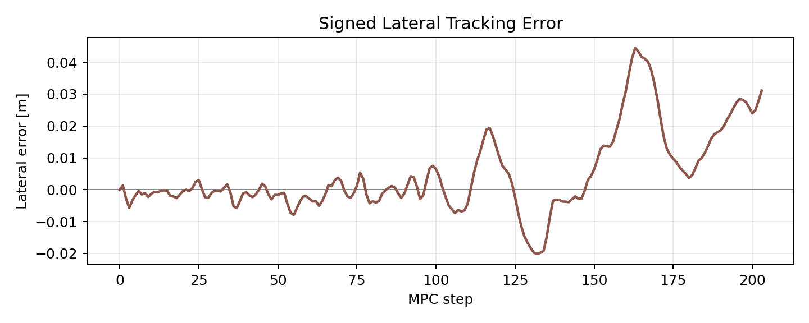
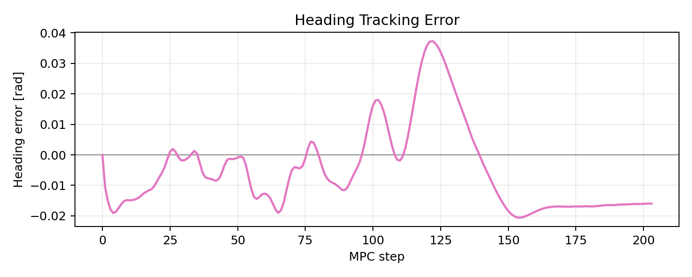
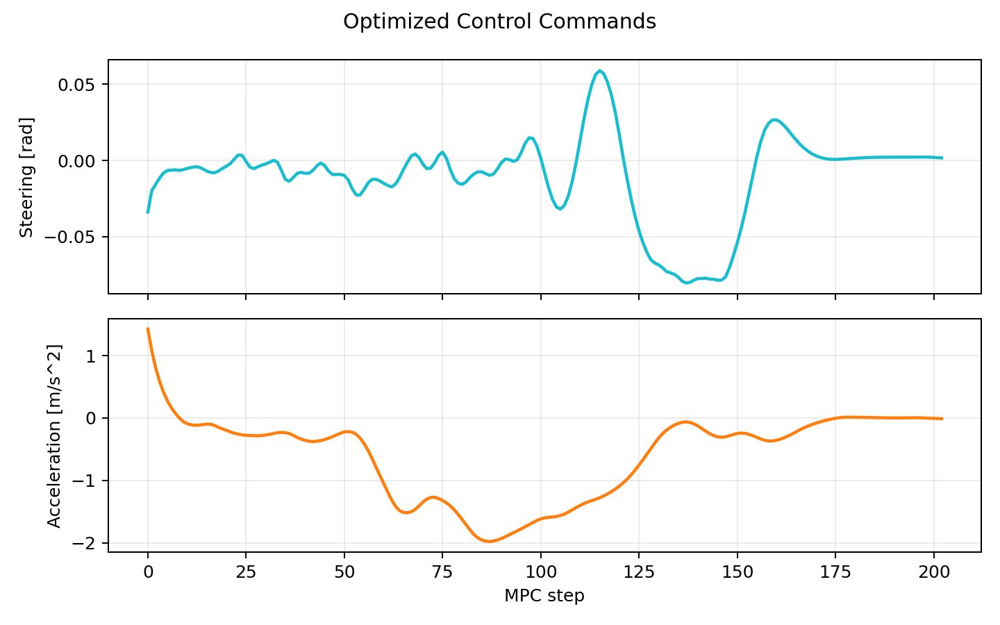
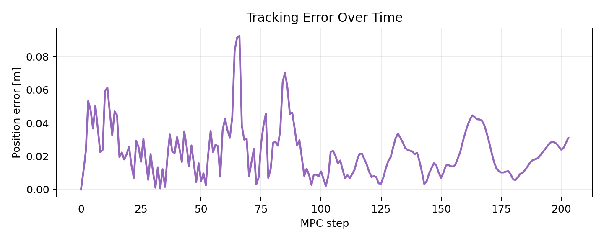

# Classical Longitudinal-Lateral MPC for Autonomous Driving

A research-oriented Python implementation of classical Model Predictive Control
(MPC) for autonomous vehicle trajectory tracking on the KITTI raw dataset.

This repository implements a combined longitudinal and lateral controller using
a kinematic bicycle model. The MPC tracks a reference trajectory generated from
KITTI ego-motion data while producing smooth steering and acceleration commands
under vehicle constraints.

The project is intended to serve as a classical-control baseline before adding
learned perception, latent trajectory prediction, and learning-based control.

## Table of Contents

- [Motivation](#motivation)
- [Method Overview](#method-overview)
- [Vehicle Model](#vehicle-model)
- [MPC Objective](#mpc-objective)
- [Dataset](#dataset)
- [Installation](#installation)
- [Running the Experiment](#running-the-experiment)
- [Results](#results)
- [Repository Structure](#repository-structure)
- [Current Status](#current-status)
- [Future Work](#future-work)

## Motivation

Modern autonomous-driving research often emphasizes deep learning and
end-to-end policies. Classical optimization-based control is still important
because it provides:

- physically feasible control inputs
- smooth actuator behavior
- explicit constraint handling
- interpretable objective terms
- stable trajectory tracking

In this project, the controller receives a reference trajectory derived from
KITTI OXTS ego-motion data and solves a finite-horizon nonlinear optimization
problem at every timestep.

The long-term research direction is:

```text
camera frames
-> latent representations
-> learned future trajectory prediction
-> MPC trajectory tracking
```

## Method Overview

The pipeline is:

```text
KITTI OXTS packets
-> local Cartesian trajectory
-> reference trajectory generation
-> nonlinear MPC optimization
-> steering and acceleration commands
-> evaluation and plots
```

The controller is combined longitudinal-lateral MPC:

- lateral control is handled through steering angle
- longitudinal control is handled through acceleration
- the predicted state includes planar position, heading, and velocity
- steering affects yaw, and yaw propagates future x-y motion

## Vehicle Model

The MPC state is:

$$
\mathbf{x}_k =
\begin{bmatrix}
p_{x,k} & p_{y,k} & v_k & \psi_k
\end{bmatrix}^{\mathsf{T}}
$$

The control input is:

$$
\mathbf{u}_k =
\begin{bmatrix}
\delta_k & a_k
\end{bmatrix}^{\mathsf{T}}
$$

The controller uses the discrete-time kinematic bicycle model:

$$
\begin{aligned}
p_{x,k+1} &= p_{x,k} + v_k \cos(\psi_k)\Delta t \\
p_{y,k+1} &= p_{y,k} + v_k \sin(\psi_k)\Delta t \\
v_{k+1} &= v_k + a_k\Delta t \\
\psi_{k+1} &= \psi_k + \frac{v_k}{L}\tan(\delta_k)\Delta t
\end{aligned}
$$

where:

| Symbol | Meaning |
| --- | --- |
| $p_x, p_y$ | vehicle position in the local Cartesian frame |
| $\psi$ | vehicle heading/yaw |
| $v$ | longitudinal velocity |
| $\delta$ | steering angle |
| $a$ | acceleration command |
| $L$ | wheelbase |
| $\Delta t$ | sampling time |

## MPC Objective

At each timestep, the controller solves a finite-horizon optimization problem
over the predicted state sequence $\mathbf{X}$ and control sequence
$\mathbf{U}$.

$$
\begin{aligned}
\min_{\mathbf{X}, \mathbf{U}} \quad
&\sum_{k=0}^{N-1}
\Big[
Q_p \left\lVert \mathbf{p}_k - \mathbf{p}^{\mathrm{ref}}_k \right\rVert_2^2
{}+ Q_v \left(v_k - v^{\mathrm{ref}}_k\right)^2 \\
&\qquad
{}+ Q_{\psi}\operatorname{wrap}\left(\psi_k - \psi^{\mathrm{ref}}_k\right)^2
{}+ R_{\delta}\delta_k^2
{}+ R_a a_k^2 \\
&\qquad
{}+ R_{\Delta\delta}\left(\delta_k - \delta_{k-1}\right)^2
{}+ R_{\Delta a}\left(a_k - a_{k-1}\right)^2
\Big] \\
&\quad
{}+ Q_f \left\lVert \mathbf{p}_N - \mathbf{p}^{\mathrm{ref}}_N \right\rVert_2^2
\end{aligned}
$$

subject to:

$$
\begin{aligned}
v_{\min} &\le v_k \le v_{\max} \\
|\delta_k| &\le \delta_{\max} \\
a_{\min} &\le a_k \le a_{\max}
\end{aligned}
$$

Only the first optimized control input is applied. The optimization is then
shifted forward and solved again at the next timestep, which gives the standard
receding-horizon MPC controller.

## Dataset

Experiments use the KITTI raw dataset sequence:

```text
2011_09_26_drive_0011_sync
```

Expected local layout:

```text
data/KITTI/
+-- 2011_09_26/
    +-- 2011_09_26_calib/
    +-- 2011_09_26_drive_0011_sync/
        +-- image_02/
        |   +-- data/
        +-- oxts/
        |   +-- data/
        |   +-- timestamps.txt
        +-- velodyne_points/
```

The current classical MPC baseline uses:

- `oxts/data/*.txt`
- `oxts/timestamps.txt`
- optionally `image_02/data/*.png` for camera availability checks

The calibration and camera folders are kept in the project layout for future
vision-based extensions. More setup detail is available in
[data/README_DATA.md](data/README_DATA.md).

## Installation

Install the Python dependencies:

```bash
pip install -r requirements.txt
```

Main dependencies:

- NumPy
- SciPy
- CasADi
- Matplotlib
- OpenCV
- PyYAML
- tqdm

## Running the Experiment

From the repository root:

```bash
python src/main.py
```

On Windows, if `python` points to a different interpreter, use:

```bash
py src/main.py
```

Configuration is stored in:

```text
configs/mpc_config.yaml
```

Important MPC parameters:

| Config key | Role |
| --- | --- |
| `mpc.horizon` | prediction horizon length |
| `mpc.weights.position` | x-y trajectory tracking weight |
| `mpc.weights.yaw` | heading tracking weight |
| `mpc.weights.velocity` | speed tracking weight |
| `mpc.weights.steering` | steering effort penalty |
| `mpc.weights.acceleration` | acceleration effort penalty |
| `mpc.weights.steering_rate` | steering smoothness penalty |
| `mpc.weights.acceleration_rate` | acceleration smoothness penalty |
| `mpc.weights.terminal_position` | terminal position tracking weight |

## Results

The default configuration is manually tuned for the first 220 frames of
`2011_09_26_drive_0011_sync`.

| Metric | Value |
| --- | ---: |
| trajectory RMSE | `0.027688 m` |
| lateral RMSE | `0.013462 m` |
| max lateral error | `0.044503 m` |
| heading RMSE | `0.014823 rad` |
| velocity RMSE | `0.238742 m/s` |
| steering smoothness | `0.000024` |
| solver success rate | `1.000000` |

The results show centimeter-scale lateral tracking, stable heading tracking,
and smooth steering behavior. Velocity tracking is stable, with a small initial
transient due to the first MPC solve having no previous applied control history.

### Trajectory Tracking

The MPC rollout closely follows the KITTI reference trajectory.



### Velocity Tracking

The longitudinal controller follows the reference speed without high-frequency
oscillation.



### Lateral Tracking Error

Signed lateral error is computed in the reference path frame by projecting
position error onto the normal direction of the reference heading.



### Heading Error

Heading error remains bounded and does not show high-frequency oscillation.



### Control Commands

The optimized steering and acceleration commands remain smooth and physically
plausible.



### Overall Tracking Error

The Euclidean tracking error remains bounded over the rollout.



## Repository Structure

```text
src/
+-- data_loader/          KITTI OXTS parsing and coordinate transforms
+-- vehicle_model/        kinematic bicycle model and vehicle constraints
+-- trajectory/           reference generation and steering estimation
+-- mpc/                  CasADi optimizer and receding-horizon controller
+-- evaluation/           lateral, heading, velocity, and smoothness metrics
+-- visualization/        trajectory, control, velocity, and error plots
+-- future_extensions/    placeholders for learned perception and latent MPC
```

Generated artifacts:

```text
outputs/
+-- plots/
+-- logs/
+-- videos/
```

The architecture audit is saved at:

```text
results/mpc_architecture_audit.md
```

## Current Status

This project currently focuses on classical control and assumes:

- known ego state from KITTI OXTS data
- known future reference trajectory
- no learned perception
- no obstacle constraints
- no ROS dependency

The current controller is a strong baseline for later comparison against
learned trajectory prediction or latent-space control.

## Future Work

The planned research direction is:

```text
camera frames
-> encoder
-> latent representation
-> future trajectory prediction
-> MPC
-> steering + acceleration
```

Future extensions include:

- camera latent encoding
- latent future trajectory prediction
- uncertainty-aware MPC
- camera-based road curvature estimation
- dynamic bicycle models
- obstacle-aware MPC constraints
- learned residual dynamics
- perception-control integration

## Research Direction

This repository is intended as a bridge between classical control theory,
machine learning, predictive perception, and autonomous-driving systems. The
long-term objective is to combine learned scene understanding with
optimization-based control for robust and physically feasible autonomous
navigation.
